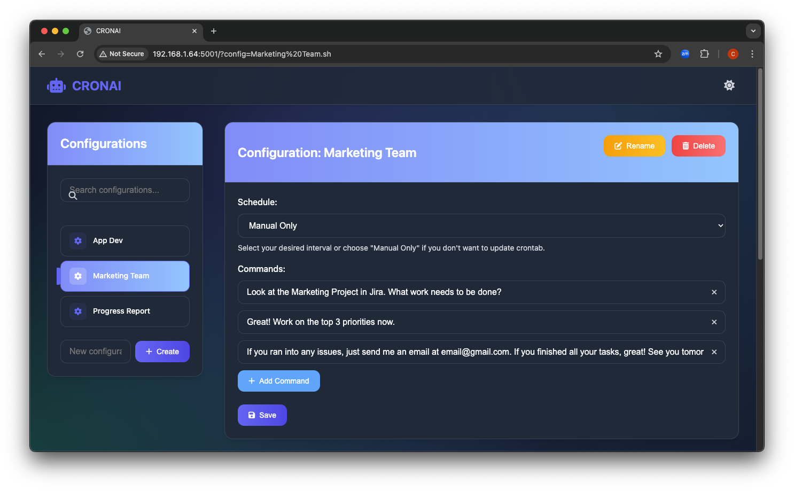

# CRONAI

CRONAI is a powerful tool designed specifically for scheduling and managing AI assistance sessions through cron jobs. It combines the scheduling capabilities of cron with the power of MCP Servers via the Goose CLI tool, enabling automated AI assistance at scheduled intervals.



## The Power of MCP Servers + Goose Integration

CRONAI was built with a singular focus: to harness the full potential of MCP Servers through scheduled automation. By leveraging the Goose CLI tool, CRONAI creates a bridge between traditional scheduling systems and advanced AI capabilities.

Key benefits of the MCP Servers + Goose integration:

- **Automated AI Workflows**: Schedule complex AI assistance tasks to run automatically
- **Server-Side Processing**: Leverage MCP Server resources for intensive AI operations
- **Consistent Assistance**: Receive regular AI-generated reports, analyses, and updates
- **Hands-Off Operation**: Set up once and let the system work for you

## Features

- **Web Interface**: Easy-to-use UI for managing your AI sessions
- **Scheduled Execution**: Schedule commands to run at specific intervals using cron
- **Real-time Output**: See the results of your commands in real-time
- **Configuration Management**: Create, edit, and manage multiple configuration profiles
- **Flexible Scheduling**: Options from "Manual Only" to daily, weekly, or monthly execution
- **MCP Server Integration**: Seamlessly works with MCP Servers via the Goose CLI

## Requirements

- Python 3.6+
- Flask
- Modern web browser
- Unix-like operating system with crontab support
- [Goose](https://github.com/yourusername/goose) CLI tool for MCP Server interaction

## Installation

1. Clone the repository:
   ```bash
   git clone https://github.com/forayconsulting/cronai.git
   cd cronai
   ```

2. Install dependencies:
   ```bash
   pip install -r requirements.txt
   ```

3. Configure the application:
   ```bash
   cp config.example.sh config.sh
   # Edit config.sh with your specific paths and settings
   ```

4. Create example configurations:
   ```bash
   mkdir -p configs
   cp templates/configs/default.sh configs/
   ```

5. Start the application:
   ```bash
   python app.py
   ```

6. Access the web interface at `http://localhost:5001`

## Usage with MCP Servers

CRONAI is designed to work seamlessly with MCP Servers through the Goose CLI tool. Here's how to leverage this powerful integration:

### Creating AI Session Configurations

1. From the CRONAI web interface, enter a name for your new configuration and click "Create"
2. Set your desired schedule (e.g., "Every day", "Manual Only")
3. Add the Goose commands you want to execute in the AI session
4. Click "Save" to store your configuration

### Example MCP Server Commands

```
Generate a weekly report on project progress
Analyze customer feedback from the last 24 hours
Monitor system performance and alert on anomalies
Create a daily summary of team activities
```

### Running AI Sessions

1. Select a configuration from the left sidebar
2. Click the "Run" button to execute the commands immediately on your MCP Server
3. View the AI output in real-time in the output panel
4. Use the "Stop" button to terminate a running session

### Scheduling Ongoing AI Support

- For configurations with a schedule other than "Manual Only", CRONAI will update your crontab automatically
- The system will connect to your MCP Server via Goose at the specified intervals
- AI-generated content will be processed according to your configuration

## Customizing

### Custom Command Templates for MCP Servers

Create reusable AI command templates by adding files to the `templates/configs/` directory:

```bash
# Example template for AI data analysis tasks
echo "Analyzing dataset..."
process_data --input $DATA_FILE --output $RESULTS_DIR
summarize_findings $RESULTS_DIR
```

### Environment Variables

You can use environment variables in your commands to make them more flexible:

```bash
analyze_text "$MY_TEXT_VAR"
```

## File Structure

```
cronai/
├── app.py                 # Main Flask application
├── config.sh              # Global configuration
├── session_scheduler.sh   # Script to execute commands on MCP Servers
├── update_cron.sh         # Script to update crontab
├── configs/               # User configurations
│   ├── App Dev.sh         # Example configuration
│   └── ...
└── templates/             # Web UI templates
    ├── index.html         # Main UI
    └── configs/           # Template configurations
        └── default.sh     # Default configuration template
```

## Troubleshooting

### Cron Jobs Not Running

1. Check if the cron service is running: `systemctl status cron`
2. Verify permissions on the script files: `chmod +x *.sh`
3. Check the cron log: `grep CRON /var/log/syslog`

### MCP Server Connection Issues

1. Verify that the `goose` CLI tool is installed and in your PATH
2. Check your MCP Server connectivity
3. Ensure your authentication credentials are valid
4. Run the session manually to see detailed error output

## Contributing

Contributions are welcome! Please feel free to submit a Pull Request.

1. Fork the repository
2. Create a feature branch (`git checkout -b feature/amazing-feature`)
3. Commit your changes (`git commit -m 'Add some amazing feature'`)
4. Push to the branch (`git push origin feature/amazing-feature`)
5. Open a Pull Request

## License

This project is licensed under the MIT License - see the [LICENSE](LICENSE) file for details.

## Acknowledgments

- Built with Flask web framework
- Uses crontab for job scheduling
- Powered by MCP Servers via Goose CLI
- Inspired by the need for automated AI assistance in development workflows
